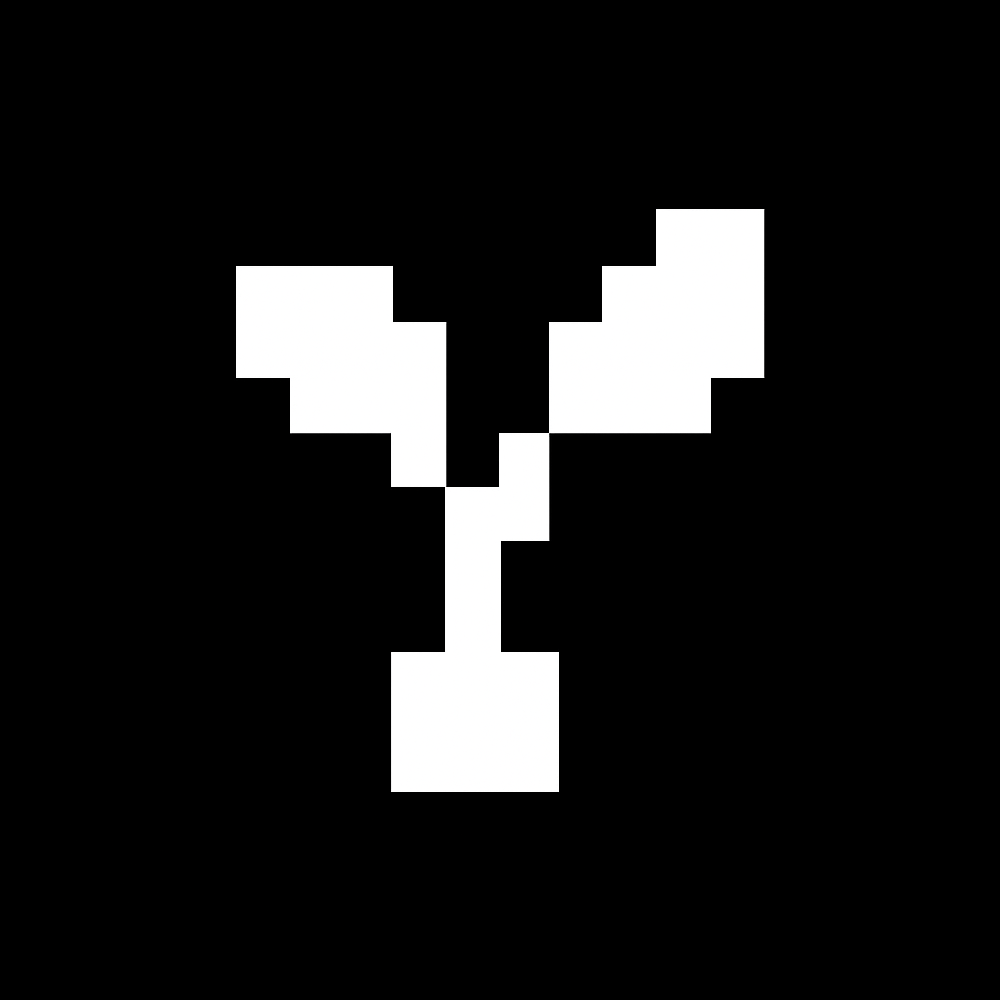

<!-- Improved compatibility of back to top link: See: https://github.com/othneildrew/Best-README-Template/pull/73 -->

<a id="readme-top"></a>

<!-- PROJECT SHIELDS (optional; replace repo/user as needed) -->
<!-- Reference-style links defined at the bottom -->

[![npm decoder][npm-decoder-shield]][npm-decoder-url]
[![npm encoder][npm-encoder-shield]][npm-encoder-url]
[![License: MIT][license-shield]][license-url]

<div align="center">
  
  <h2>tinysprites</h2>
  <p>
    Ultra‑tiny sprite system for JS13K and web games — pixel‑art native, scales crisp like vectors.
  </p>
  <p>
    <a href="#about-the-project"><strong>Explore the docs »</strong></a>
    ·
    <a href="#usage">Usage</a>
    ·
    <a href="#getting-started">Install</a>
    ·
    <a href="https://github.com/m-de-graaff/tinysprite">View Repo</a>
    ·
    <a href="https://github.com/m-de-graaff/tinysprite/issues/new?labels=bug&template=bug_report.md">Report Bug</a>
    ·
    <a href="https://github.com/m-de-graaff/tinysprite/issues/new?labels=enhancement&template=feature_request.md">Request Feature</a>
  </p>
</div>

<details>
  <summary>Table of Contents</summary>
  <ol>
    <li>
      <a href="#about-the-project">About The Project</a>
      <ul>
        <li><a href="#features">Features</a></li>
        <li><a href="#built-with">Built With</a></li>
      </ul>
    </li>
    <li>
      <a href="#getting-started">Getting Started</a>
      <ul>
        <li><a href="#prerequisites">Prerequisites</a></li>
        <li><a href="#installation">Installation</a></li>
      </ul>
    </li>
    <li><a href="#usage">Usage</a></li>
    <li><a href="#api">API</a></li>
    <li><a href="#examples">Examples</a></li>
    <li><a href="#projects-using-tinysprites">Projects Using tinysprites</a></li>
    <li><a href="#development">Development</a></li>
    <li><a href="#roadmap">Roadmap</a></li>
    <li><a href="#contributing">Contributing</a></li>
    <li><a href="#license">License</a></li>
  </ol>
</details>

## About The Project

tinysprites is a tiny rendering format and runtime designed for game jams and web games. It focuses on gzipped bundle size and pixel‑perfect scaling while supporting sprites, simple tilemaps, and animations. The encoder performs quantization and packing so the runtime stays minimal.

### Features

- Ultra‑small decoder: profile‑based, tree‑shakable
- Pixel‑perfect scaling at any zoom
- Sprites, simple tilemaps, basic animations
- Works with `<canvas>`, ``, Phaser, Kontra, and custom engines
- Encoder (Node/TS) picks optimal packing for best zipped size
- Subpath exports let you import only what you need

### Built With

- TypeScript
- pnpm workspaces
- pngjs, gifuct-js (encoder)
- tsup (build)

<p align="right">(<a href="#readme-top">back to top</a>)</p>

## Getting Started

### Prerequisites

- Node.js 20+
- A package manager (pnpm, npm, or yarn)

### Installation

Runtime (for your game):

```bash
pnpm add @tinysprites/decoder
# or
npm i @tinysprites/decoder
```

Encoder CLI (to build packs):

```bash
pnpm add -D @tinysprites/encoder
# or run ad-hoc without installing
npx tinysprites-encode --help
```

<p align="right">(<a href="#readme-top">back to top</a>)</p>

## Usage

### Draw a sprite on canvas

```ts
import { drawTiny, toPNGDataURL } from "@tinysprites/decoder";

// Sprite stream can be an object { w, h, s } or a string with width/height in opts
const stream = { w: 16, h: 16, s: "...packed stream..." };

const canvas = document.querySelector("canvas")!;
const ctx = canvas.getContext("2d")!;

// Draw at (10, 20) scaled 4× with optional palette mapping
drawTiny(ctx, stream, 10, 20, 4, { pal: ["#000", "#fff"] });

// Export as a data URL (e.g., to use in an )
const url = await toPNGDataURL(stream, 4);
document.querySelector("img")!.src = url;
```

### Generate a pack from PNG/GIF

```bash
# Basic usage: writes JSON to stdout
npx tinysprites-encode ./player.png > pack.json

# Options
npx tinysprites-encode \
  --max 16 \
  --scan row,serp \
  --packers text,b64 \
  --rects true,false \
  --profile sprites \
  --pack out.json \
  assets/*.png
```

CLI usage help matches the encoder's `cli.ts`:

```
tinysprites-encode [--max 16|32] [--scan row,serp,...] [--packers text,b64,hex] [--rects true,false] [--out out.json] [--pack out.json] [--profile sprites|anim|tilemap] <file1.png|gif> [file2 ...]
```

<p align="right">(<a href="#readme-top">back to top</a>)</p>

## API

All imports below are from `@tinysprites/decoder` unless noted.

```ts
// Draw a tiny sprite onto a 2D canvas
function drawTiny(
  ctx: CanvasRenderingContext2D,
  stream: string | { w: number; h: number; s: string },
  x: number,
  y: number,
  scale?: number,
  opts?: {
    pal?: (string | number)[];
    palMap?: number[];
    flipX?: boolean;
    flipY?: boolean;
  }
): void;

// Render helpers and exporters
function drawMap(
  ctx: CanvasRenderingContext2D,
  mapStream: any,
  tiles: any[],
  x: number,
  y: number
): void;
function toPNGDataURL(
  stream: { w: number; h: number; s: string },
  scale?: number
): Promise<string>;
function toSVG(stream: any, scale?: number, opts?): string;
function toSVGDataURL(stream: any, scale?: number, opts?): string;
function toBlob(stream: any, scale?: number): Promise<Blob>;
function toSpriteSheetPNG(
  frames: { w: number; h: number; s: string }[],
  cols: number,
  scale?: number
): Promise<{
  dataURL: string;
  json: {
    frames: { x: number; y: number; w: number; h: number }[];
    size: { w: number; h: number };
  };
}>;

// Deep import to access lower-level canvas helpers if needed
// import { prerenderTile } from '@tinysprites/decoder/canvas/sprites'
```

Notes:

- `toPNGDataURL`/`toBlob`/`toSpriteSheetPNG` require the `{ w, h, s }` form.
- When using other APIs with a string stream, provide `w` and `h` via options or use `{ w, h, s }`.
- Prefer subpath imports (e.g., `@tinysprites/decoder/export/png`) to keep bundles tiny.

<p align="right">(<a href="#readme-top">back to top</a>)</p>

## Examples

Small demos live in `examples/`:

- `examples/canvas-demo`
- `examples/image-demo`
- `examples/kontra-demo`
- `examples/phaser-demo`

<p align="right">(<a href="#readme-top">back to top</a>)</p>

## Projects Using tinysprites

- **tinysprites editor**: Browser-based pack editor built with the decoder — see `packages/editor`.

Want your project listed? Open a PR to add it here with:

- **name** and **link**
- **short description** (1 sentence)

<p align="right">(<a href="#readme-top">back to top</a>)</p>

## Development

Clone and install:

```bash
git clone https://github.com/m-de-graaff/tinysprite.git
cd tinysprite
pnpm install
```

Build:

```bash
pnpm -C packages/decoder build
pnpm -C packages/encoder build
# minimal profile only
pnpm -C packages/decoder build:minimal
```

Size and CI checks:

```bash
pnpm run ci:check
pnpm run size:report
```

<p align="right">(<a href="#readme-top">back to top</a>)</p>

## Roadmap

- Encoder options presets (jam, balanced, quality)
- Better animation and tilemap tooling
- Editor polish and export flows

See the [open issues](https://github.com/m-de-graaff/tinysprite/issues) for more.

<p align="right">(<a href="#readme-top">back to top</a>)</p>

## Contributing

Contributions are welcome! Please see [CONTRIBUTING.md](CONTRIBUTING.md) for setup, guidelines, and PR tips.

<p align="right">(<a href="#readme-top">back to top</a>)</p>

## License

Distributed under the MIT License. See `LICENSE` for details.

<p align="right">(<a href="#readme-top">back to top</a>)</p>

<!-- MARKDOWN LINKS & IMAGES -->

[npm-decoder-shield]: https://img.shields.io/npm/v/%40tinysprites%2Fdecoder.svg?style=for-the-badge
[npm-decoder-url]: https://www.npmjs.com/package/@tinysprites/decoder
[npm-encoder-shield]: https://img.shields.io/npm/v/%40tinysprites%2Fencoder.svg?style=for-the-badge
[npm-encoder-url]: https://www.npmjs.com/package/@tinysprites/encoder
[license-shield]: https://img.shields.io/badge/License-MIT-green.svg?style=for-the-badge
[license-url]: LICENSE
